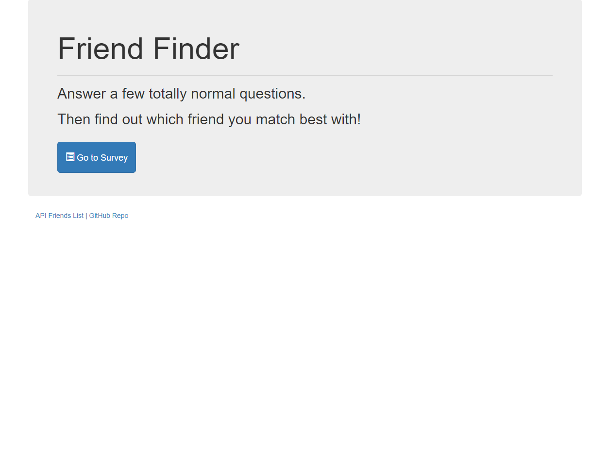

# Friend Finder App

## Overview
A website that uses

* front end (HTML with Bootstrap and jQuery) and 
* back end (Javascript, Node.js, Express) code 

to take in the results fom a user inputted survey and compares the user's selection with a database of best possible "friends" to match with.

---

## NPM Packages

* express
* path

---

## Technologies Used
* HTML
* CSS
* Bootstrap
* Javascript
* Node.js
* jQuery
* Express.js
* JSON

---

## File Structure

-Root
* server.js
* package.json
* data
  * friends.js
* public
  * home.html
  * survey.html
* routing
  * apiRoutes.js
  * htmlRoutes.js
  
---

## Deployed Link: 
[Friend Finder](https://calm-badlands-91918.herokuapp.com/)

---

## Screenshot

